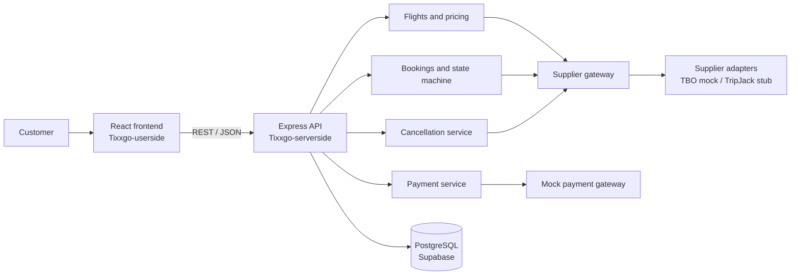

# Tixxgo

Tixxgo is an online flight and hotel platform. Phase 0 provides the backend foundation.

> **For a complete flow understanding of the codebase, go through [flight_booking_system_architecture](docs/FILE-FLOW.md).**

## Project architecture



## Travel API integration plan

### Add the primary supplier

1. Define the supplier's request and response types in `src/suppliers/adapters/<supplier>/` and implement the existing `SupplierAdapter` contract. Keep credentials and supplier-specific fields inside this adapter folder.
2. Add a client for the supplier's search, fare revalidation, booking, booking-status, cancellation-quote, and cancellation APIs. Configure credentials and endpoints through server-side environment variables; never send secrets or raw supplier responses to the browser.
3. Map supplier responses into Tixxgo's internal types in a supplier-specific mapper. Normalize flight segments, baggage, fare conditions, supplier references, and prices. Convert INR amounts to integer paise before pricing.
4. Register the adapter in `src/suppliers/runtime.ts`. Let `SupplierGateway` own routing, timeouts, and normalized supplier errors so flight, booking, and cancellation modules do not depend on supplier-specific code.
5. Verify search, revalidation, booking, timeout/status recovery, and cancellation against supplier test scenarios before enabling live traffic. Keep supplier cost, Tixxgo fees/discounts, and customer price as separate values.

### Add Supplier #2 later

Implement the same adapter contract and add its mapper/client under `src/suppliers/adapters/<supplier2>/`, then register it in `runtime.ts` and enable it with `ENABLED_SUPPLIERS`. The existing gateway can fan out flight searches; `FlightService` can price and persist the normalized results, and `OfferSelector` can group comparable fare products and retain alternatives. Add supplier-specific mapper and flow tests, plus supplier statistics and configuration, without changing the frontend DTOs or booking flow. Only retry a different supplier after revalidating its fare and confirming the fallback is equivalent; keep different fare products as separate options.

## Assumptions, limitations, and production work

### Assumptions

- The current customer journey is for flights, INR fares, and a single adult. Hotels and other passenger combinations are outside this UI flow.
- Supplier and payment integrations are mocked for demonstration; no real payment is collected or ticket issued.
- Search offers expire after 15 minutes and fare quotes after 10 minutes. Booking always uses a freshly revalidated quote.
- Current pricing uses a ₹299 service fee and ₹200 promotion discount. The cancellation fee is configurable and currently set to zero.
- PostgreSQL is the source of persisted booking state. Supplier-specific raw payloads are stored server-side for internal use.

### Known limitations

- TBO is represented by an in-process mock; TripJack is only a stub. Mock supplier bookings and scenario settings live in memory and do not survive a process restart.
- The frontend journey state is memory-only, supports one traveller in its form, and has no cancellation screen.
- Notifications are recorded in the database but are not delivered as email or SMS. Reconciliation is exposed as demo endpoints; no scheduler/worker is started by the app.
- Authentication and authorization are not implemented. Development scenario controls and admin reconciliation endpoints need protection before public deployment. Personal traveller/contact data is not encrypted at the application layer.

### Improve before production

- Complete and certify real supplier adapters; protect credentials with a secrets manager and verify all supplier contract, timeout, and idempotency behavior.
- Add authentication, authorization, request rate limits, and restrict or remove mock and admin routes. Configure CORS for explicit trusted frontend origins.
- Integrate a real payment provider with signed webhook verification, durable idempotent refunds, and reconciliation for uncertain payment outcomes.
- Run reconciliation in a durable queue/worker with backoff and alerting. Add an outbox for reliable notification delivery and metrics/alerts for unknown bookings.
- Encrypt sensitive personal data, define retention/access controls, and add production logging, monitoring, backups, and deployment checks.

## Local backend setup

1. Create a Supabase project at [supabase.com](https://supabase.com) and copy its PostgreSQL connection details from **Project Settings > Database**.
2. Use the direct PostgreSQL connection string for local development. Keep the database password private.

3. Install dependencies and configure the backend:

   ```powershell
   cd Tixxgo-serverside
   npm install
   Copy-Item .env.example .env
   ```

   Update `DATABASE_URL` in `.env` with the Supabase PostgreSQL connection string. Keep `DATABASE_SSL=true` for Supabase.

4. Run migrations and start the API:

   ```powershell
   npm run migrate
   npm run dev
   ```

5. Check the API:

   ```powershell
   Invoke-RestMethod http://localhost:3000/health
   ```

6. Start the customer frontend in a second terminal:

   ```powershell
   cd Tixxgo-userside
   npm install
   npm run dev
   ```

   Open `http://localhost:5173/`. Vite proxies `/api` requests to the backend at `http://localhost:3000` during development.

The health response includes database connectivity. `GET /api/dev/error` is a development probe for the standard `AppError` response and is disabled outside development/test environments. The mock supplier scenario can be viewed with `GET /api/dev/mock-supplier/scenario` or changed with `POST /api/dev/mock-supplier/scenario` using `{ "scenario": "NORMAL" }`.

## Adding TripJack

TripJack is intentionally a stub in Phase 2. To add it, implement the `SupplierAdapter` methods and a TripJack mapper inside `src/suppliers/adapters/tripjack/`, register the adapter in `src/suppliers/runtime.ts`, and add `tripjack` to `ENABLED_SUPPLIERS`. No flights, bookings, or payments module should import the adapter directly.

## Supplier booking reconciliation

Phase 8 exposes `POST /api/admin/reconcile` for the demo. Supplier booking attempts are protected by the same `clientReference` (`booking_reference`), an attempt row created before the supplier call, row locks, and the unique `(booking_id, attempt_no)` constraint. `IN_FLIGHT` and `UNKNOWN` attempts are status-checked and never created again. Two consecutive `NOT_FOUND` status checks are treated as a definitive failure and refunded; `PENDING` remains `SUPPLIER_BOOKING_UNKNOWN`, and the retry limit moves the booking to `MANUAL_REVIEW`.

## Cancellation

`POST /api/bookings/:bookingId/cancel` supports a preview with `{ "confirm": false }` and an idempotent confirmation with `{ "confirm": true, "cancellationQuoteId": "..." }`. The estimated refund formula is `max(0, customerTotal - airlineCharge - TixxgoCancellationFee - nonRefundableServiceFee)`. A supplier cancellation timeout remains `CANCELLATION_REQUESTED`; `POST /api/admin/reconcile-cancellations` status-checks it and never assumes cancellation or issues a refund prematurely.

## Offer selection

Phase 10 groups offers by a normalized itinerary and fare product. It selects the best comparable offer using selling price, supplier success rate, latency, and margin; unhealthy suppliers are excluded when a healthy comparable offer exists. The selected offer stores fallback offer IDs in the server-only `flight_offers.fallback_offers` column. Different fare families, baggage, or refundability remain separate customer options.

## Commands

Run these from `Tixxgo-serverside/`:

- `npm run dev` - start the API with `tsx`
- `npm run build` - compile TypeScript
- `npm start` - run the compiled API
- `npm run migrate` - apply Knex migrations
- `npm run migrate:rollback` - roll back the latest migration batch
- `npm run seed` - run Knex seeds
- `npm test` - run unit tests
