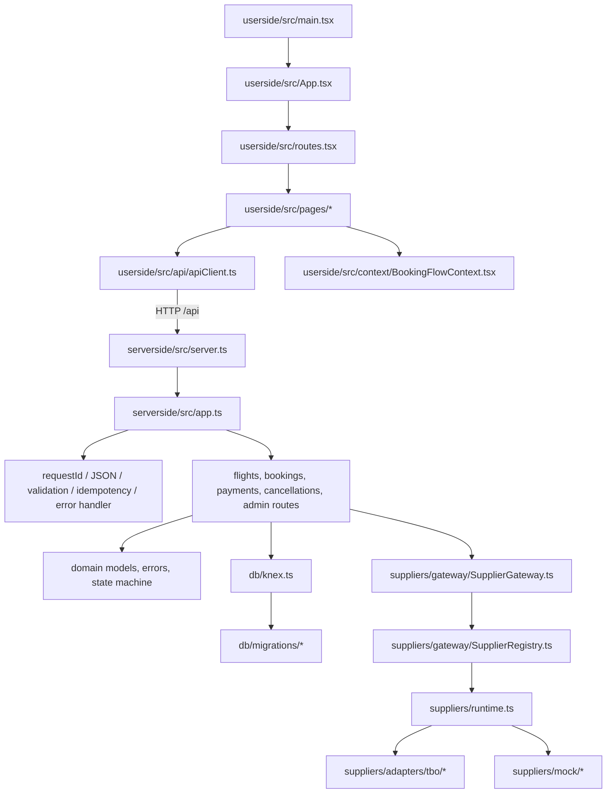
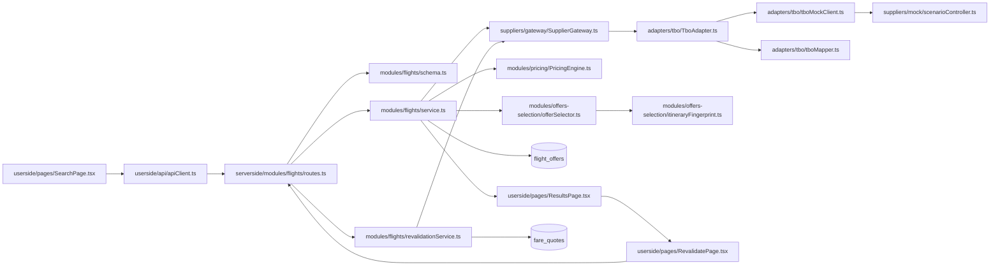
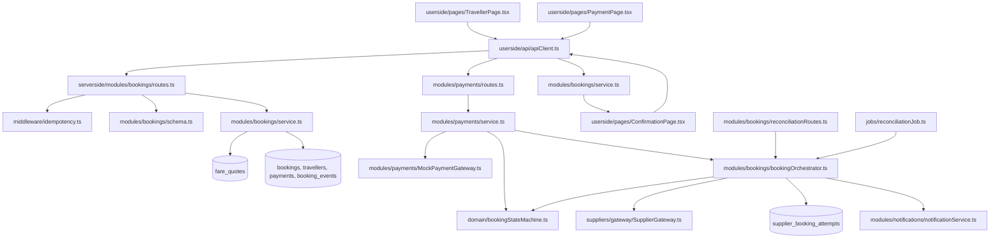
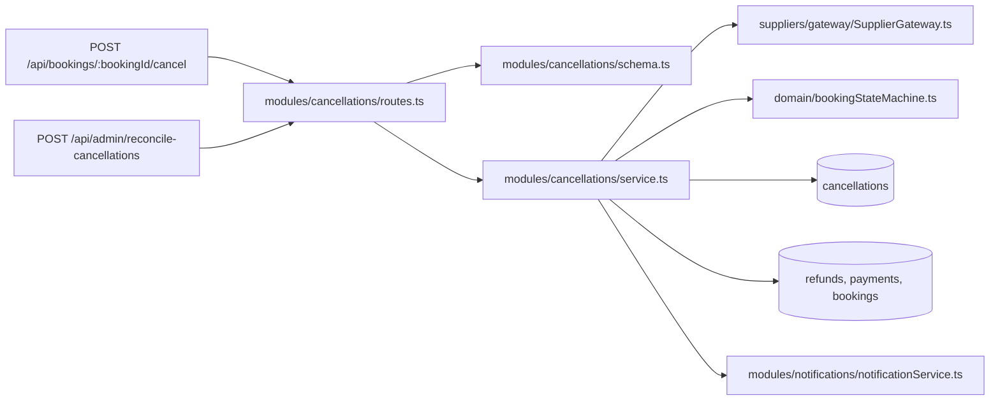

# Tixxgo File Flow

This guide shows which files call or depend on which other files during the main customer and operations flows. It follows the actual source layout; the customer web app is `Tixxgo-userside/` and the API is `Tixxgo-serverside/`.

## Application startup and request path

The UI is wired together by `main.tsx` → `App.tsx` → `routes.tsx`. Pages use `apiClient.ts` for HTTP calls and `BookingFlowContext.tsx` for temporary journey state. On the API side, `server.ts` starts the Express app built in `app.ts`; that file creates the supplier and payment runtimes and mounts the module routers.

## Flight search to fare quote

`FlightService` is the point where supplier offers become customer offers: it prices, selects, persists both normalized and raw supplier data, then returns the normalized result. The TBO mapper and adapter contain supplier-specific details. `FareRevalidationService` uses the saved offer to ask the gateway for a fresh fare and persist a quote. Quote acceptance is handled by the same service and routes.

## Booking, payment, and supplier confirmation

`BookingService` checks quote status/expiry and writes the booking record with travellers and a pending payment. `PaymentService` handles mock gateway creation and callbacks; a successful callback transitions the booking and hands off to `BookingOrchestrator`. The orchestrator owns supplier booking attempts, status resolution, refunds after definitive supplier failure, and notifications. `bookingStateMachine.ts` defines allowed booking status changes and writes audit events. The admin reconciliation endpoint calls the same orchestrator; `jobs/reconciliationJob.ts` is a callable wrapper for a scheduler.

## Cancellation flow

The cancellation route supports a quote preview (`confirm: false`) and confirmation (`confirm: true`). `CancellationService` obtains the supplier charge, calculates and stores an estimate, then on confirmation transitions the booking, calls the supplier, and initiates the payment refund. Reconciliation of a pending supplier cancellation is in the same service.

## Shared infrastructure and persistence

| Concern | Files |
|---|---|
| API setup and routes | `serverside/src/server.ts`, `serverside/src/app.ts` |
| Request validation and errors | `middleware/validate.ts`, `middleware/errorHandler.ts`, `domain/errors.ts` |
| Request IDs and idempotency | `middleware/requestId.ts`, `middleware/idempotency.ts` |
| Database connection and schema | `db/knex.ts`, `db/migrations/*.ts`, `db/seeds/*.ts` |
| Booking status and audit history | `domain/bookingStateMachine.ts`, `booking_events` table |
| Integer money conversion | `utils/money.ts`, `modules/pricing/PricingEngine.ts` |
| Supplier contract and routing | `suppliers/contracts/*`, `suppliers/gateway/*`, `suppliers/runtime.ts` |
| Mock supplier controls | `suppliers/mock/*`, `adapters/tbo/tboMockClient.ts` |
| Customer-facing journey state | `userside/src/context/BookingFlowContext.tsx` |

The initial schema and later migrations define the tables used by these flows: `flight_offers`, `fare_quotes`, `bookings`, `travellers`, `payments`, `supplier_booking_attempts`, `booking_events`, `cancellations`, `refunds`, `idempotency_keys`, `notifications`, and `supplier_stats`.

## Other frontend files

- `ResultsPage.tsx` displays offers and starts revalidation.
- `RevalidatePage.tsx` displays the fresh fare and handles acceptance.
- `TravellerPage.tsx` creates the booking.
- `PaymentPage.tsx` simulates success/failure payment callbacks.
- `ConfirmationPage.tsx` reads booking state and polls while supplier confirmation is pending.
- `types/api.ts` contains the frontend API data shapes; `App.css` and `index.css` provide styling.
- `vite.config.ts` configures the development API proxy; `package.json` defines the frontend scripts.

## Other backend files

- `modules/pricing/pricingRules.ts` defines the service fee and promotion rules used by `PricingEngine.ts`.
- `modules/payments/MockPaymentGateway.ts` simulates payment and refund operations.
- `modules/bookings/reconciliationRoutes.ts` exposes booking reconciliation for the demo.
- `modules/cancellations/schema.ts` validates preview and confirm requests.
- `config/env.ts` and `config/constants.ts` hold runtime configuration and business constants.
- `utils/logger.ts` and `utils/money.ts` provide shared logging and money helpers.
- `adapters/tripjack/TripJackAdapter.ts` is an extension stub implementing the supplier contract.
- `tests/*.test.ts` cover the API app, search validation and flow, pricing, mapper, offer selection, state machine, and related behavior.
